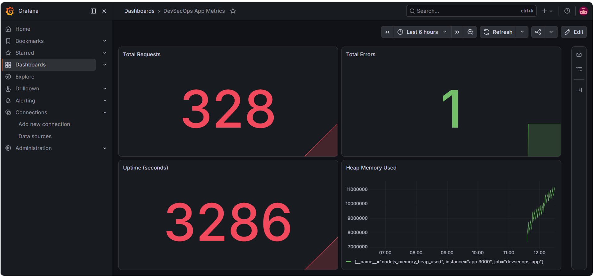

# DevSecOps CI/CD Pipeline

Simple devsecops project using Docker, Github Actions and Prometheus/Grafana for monitoring.

## What it does

Code Push -> Github Actions -> Docker Build -> Deploy -> Monitoring

| Stage | Tool |
|-------|------|
| Code Quality | ESLint |
| Testing | Jest + Supertest |
| Build | Docker |
| Security Scan | Trivy + npm audit |
| Deploy | Docker |
| Monitoring | Prometheus + Grafana |

## Tech Used

Node.js, Express, Jest, Docker, Docker Compose, Github Actions, Trivy, Prometheus, Grafana, ESLint

## Dashboard



Shows total requests, errors, uptime and memory usage in real time.

## How to Run

```bash
git clone https://github.com/Amanchauhan12/devsecops-pipeline
cd devsecops-pipeline
cp .env.example .env
docker-compose up -d
```

- App: http://localhost:3000
- Metrics: http://localhost:3000/metrics
- Prometheus: http://localhost:9090
- Grafana: http://localhost:3001 (login from .env file)

## Author

Aman Chauhan
